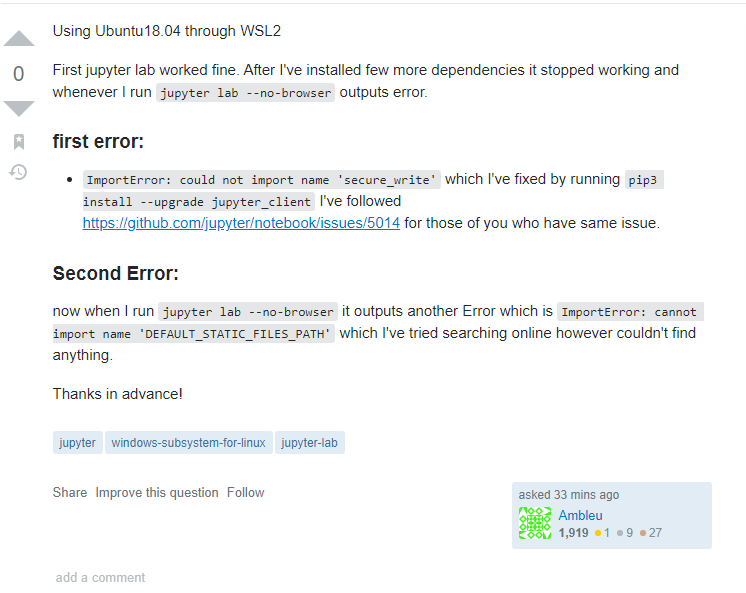

## The smart way
### "ImportError: cannot import name 'DEFAULT_STATIC_FILES_PATH' when trying to run Jupyter lab"
(https://stackoverflow.com/questions/65930449/importerror-cannot-import-name-default-static-files-path-when-trying-to-run-j)

As I was scrounging the forums of StackOverflow, I've come across a question formatted in an exceptional way. The beauty of this question formatting style is all in the title. As mentioned in Eric Raymond's essay, the goal of trying to run Jupyter lab is clearly defined. Also that the title of the post gives the error message and a clear understanding of the problem at hand. In the body of the post, the author explains what exactly he/she is using and provides a link to the solutions they have attempted so far. The question is short and straight to the point while leaving out all unnecessary information and even thanks potential commenters in advance.

## The dumb way
### Is there a python library where the user of an app can create an item and then delete it by sliding with their finger?
(https://stackoverflow.com/questions/65930518/is-there-a-python-library-where-the-user-of-an-app-can-create-an-item-and-then-d)

Although I do not wish the flame the author of this post, there is definately a more efficient way of finding the solution to this problem. By doing a personal search in of the python library or even doing a well-worded google search can produce the answers for this problem. It is clear that the author didn't do much homework before posting a question and is expecting handouts. Already we can see other users disliking their post, but even so it is such a simple question that a few kind hearted folks took the time out of their day to give the author a response. 

## Why over complicate it?

The difference between a smart and dumb question varies with the quality of answers you receive. Although a smart question may take longer for other users to provide feedback, the quality of the answer will be worth the wait. Typically when a smart question gets answered, the responder usually knows what they're talking about. On the other side, dumb questions attract answers from everyone and their mother. The quality of feedback is usually short-thought and will just lead to more questions from the author. As computer scientists, it is very important to post smart questions that fufill our questions and to do background research before posting the question to any forum or discussion board.  
